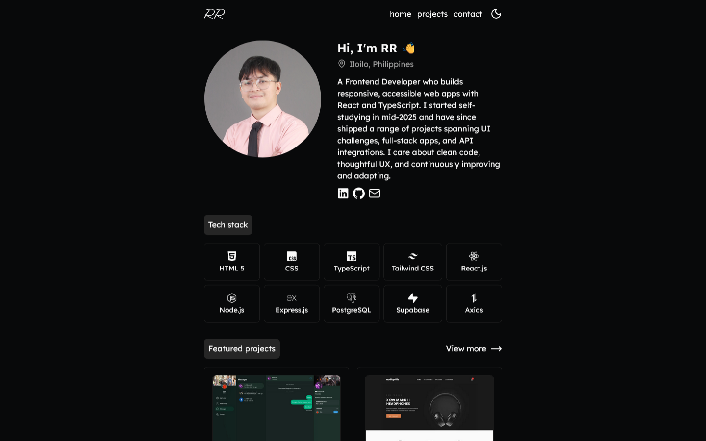
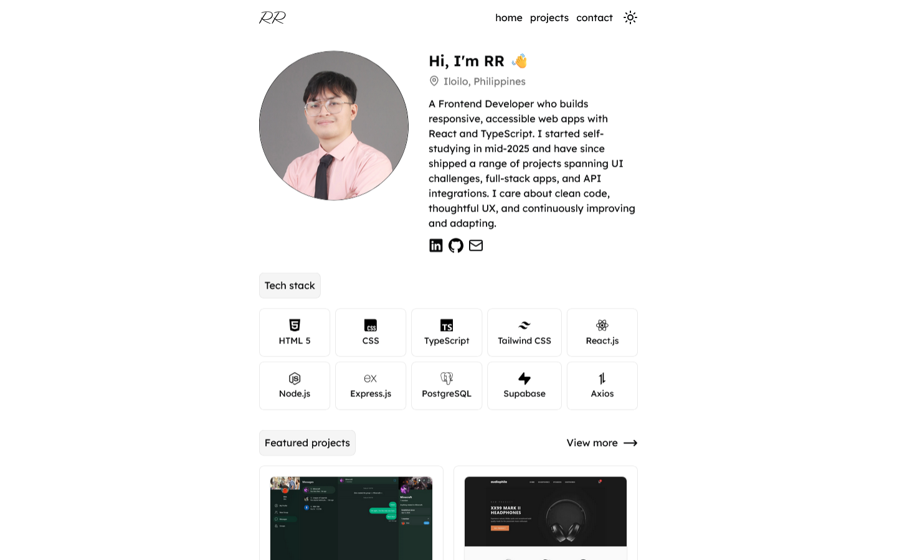
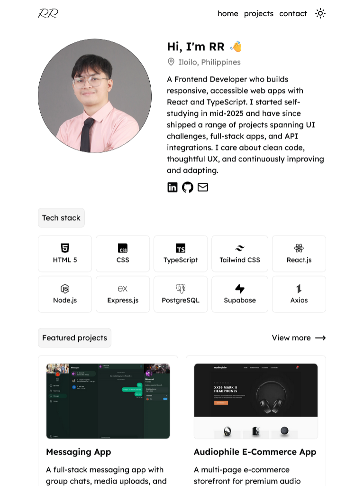
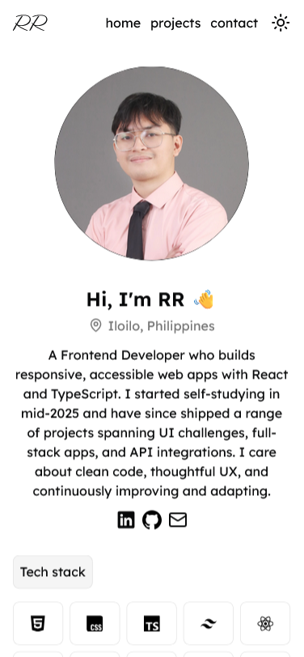
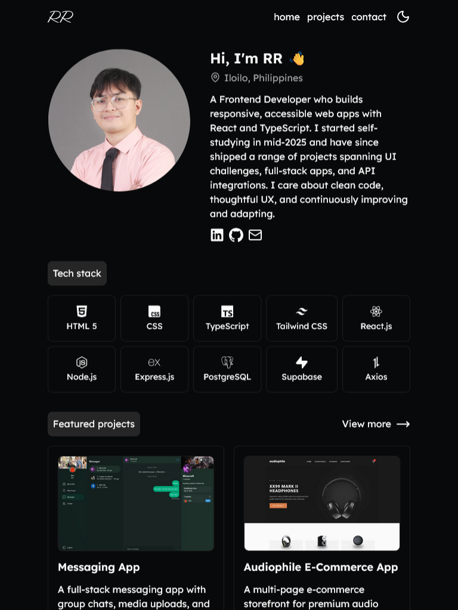
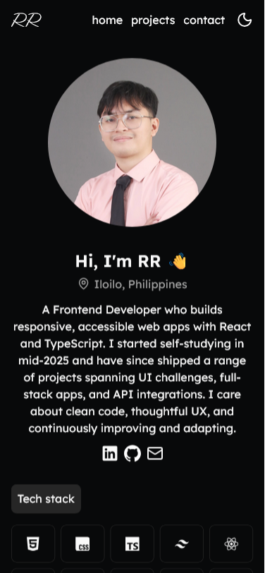

# Personal Portfolio

> My personal developer portfolio — projects, skills, and ways to get in touch.



**Live Demo:** [rrnofuente.vercel.app](https://rrnofuente.vercel.app)

---

## Overview

This is my personal portfolio website showcasing who I am, the technologies I work with, the projects I've built, and how to reach me. Built with React and designed with a focus on clean presentation and smooth navigation.

---

## Features

- About section with background and introduction
- Tech stack display
- Project cards linking to live demos and source code
- Contact section

---

## Tech Stack

| Category | Technology |
|---|---|
| Framework | React + Vite |
| Language | TypeScript |
| Styling | Tailwind CSS |
| Routing | React Router |
| UI Components | Radix UI |
| State Management | Zustand |

---

## Getting Started

### Prerequisites

- Node.js `v18+`

### Installation

```bash
git clone https://github.com/nofuenterr/personal-portfolio.git
cd personal-portfolio
npm install
```

### Running the App

```bash
npm run preview
```

### Build

```bash
npm run build
```

---

## Screenshots

### Light Mode
| Desktop | Tablet | Mobile | 
|---|---|---|
|  |  |  |

### Dark Mode
| Desktop | Tablet | Mobile | 
|---|---|---|
|  |  |  |

---

## To-do

- [ ] Add more projects
- [ ] Add transitions and animations
- [ ] Add mobile view on project screenshots
- [ ] Improve overall UX

---

## Credits

This project is for personal use.

---

*Developed by **RR Nofuente***